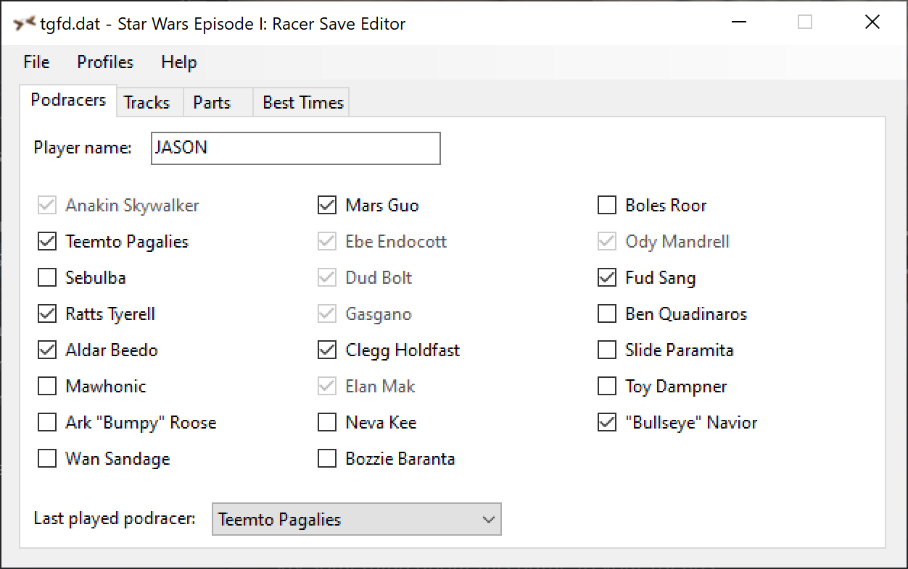
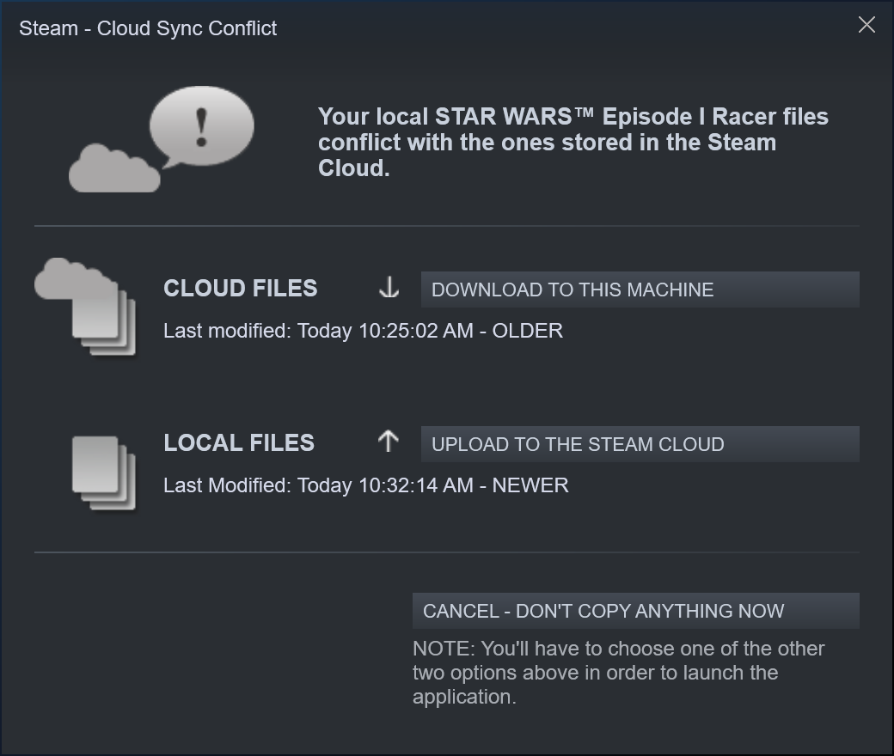

# ep1-racer-save-editor

A save game editor for *Star Wars Episode I: Racer*. Written in C# using Windows Forms. The editor works with the Windows version of the game released in 1999.

## Releases

Binary versions are available on the [Releases](https://github.com/jcfieldsdev/ep1-racer-save-editor/releases) page.

Requires .NET Framework 4.7.2 or higher to be installed.

## Steam integration

If you have the [Steam version](https://store.steampowered.com/app/808910/STAR_WARS_Episode_I_Racer/) of the game installed, you can open its saved game file directly by selecting the "Open from Steam Account" item from the *File* menu.

If you're using Steam Cloud syncing for the game, you might encounter a cloud sync conflict alert the next time you launch the game after modifying the save file:

Select "Upload to the Steam Cloud" to overwrite the version of the save file stored in the Steam Cloud and use the modified local version instead.

## Acknowledgments

Save format taken from [swe1r-tools](https://github.com/OpenSWE1R/swe1r-tools) by [OpenSWE1R](https://github.com/OpenSWE1R).

Steam integration derived from [SonicCD-SaveEditor](https://github.com/Rubberduckycooly/SonicCD-SaveEditor) by [Rubberduckycooly](https://github.com/Rubberduckycooly).

## Authors

- J.C. Fields <jcfields@jcfields.dev>

## License

- [GNU General Public License, version 3](https://opensource.org/licenses/GPL-3.0)
